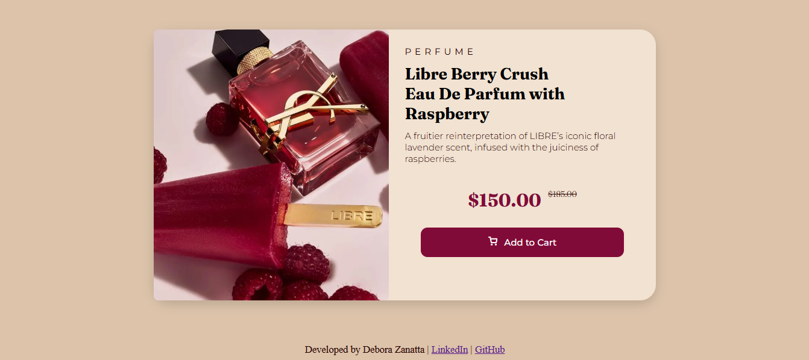
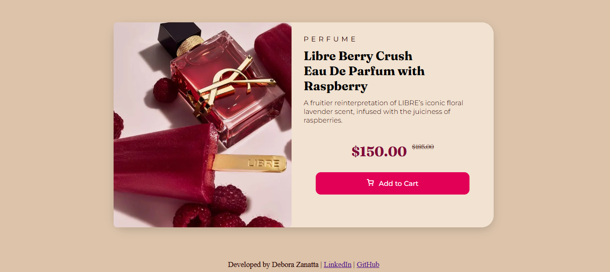

# Pixel Perfect Perfume Card 🌸

## Table of contents

- [Overview](#overview)
- [Screenshot](#screenshot)
- [Links](#links)
- [My process](#my-process)
- [Built with](#built-with)
- [What I learned](#what-i-learned)
- [Author](#author)

## Overview

This is a responsive, high-fidelity static perfume product card built with semantic HTML5 and modern CSS3, following strict Figma design specifications. It features a clean layout, custom typography, and a responsive design adapted for mobile, tablet, and desktop screens.

It was inspired by a project from Frontend Mentor.

The color palette was inspired by Color Hunt. I chose pastel tones because they create a soft and pleasant visual experience that matches the aesthetic I wanted for the project.

I aimed to keep the code clean and use only what was necessary to accurately reproduce the Figma design.

### Screenshot

### Links

- Solution URL: https://github.com/dehzanatta03/perfume-preview-card
- Live Site URL: https://perfume-preview-card-beta.vercel.app/

## My process

I started by planning the visual design and overall user experience. I researched the product image, chose the fonts from Google Fonts, selected the color palette from Color Hunt, and created the favicon.

Since this was a relatively small project, I started by building the entire HTML5 structure and defining the classes I would use for styling.

After that, I created the `global.css` file to define the CSS custom properties used throughout the project. This made the code easier to maintain, since changing something like the main text color only requires updating one variable instead of searching through multiple selectors.

Once the structure and variables were in place, I moved on to styling the page.

### Built with

- Semantic HTML5 markup
- CSS custom properties (`:root` variables)
- Flexbox
- CSS media queries
- Responsive design
- CSS `object-fit`
- Google Fonts (Montserrat and Fraunces)

### What I learned

For this project, I wanted to challenge myself more on the design and responsive layout compared to my previous project.

I created three different versions of the same page, adapting the layout to mobile, tablet, and desktop screens. This made me think more carefully about how users would experience the page at different screen sizes.

I chose a vertical layout for mobile and a horizontal layout for tablet and desktop. Keeping the mobile layout horizontal would have required sacrificing image size, text spacing, and overall readability, which would have resulted in a less pleasant experience for the user.

This was the first project where I implemented a responsive layout entirely on my own. At first, understanding how to structure the CSS cleanly while keeping the final result as close as possible to the design was challenging.

I also learned how to make elements stretch appropriately across different screen sizes, how to make the purchase button adapt to the available space, and how to introduce responsive changes without breaking the existing layout.

Overall, this was a fun and relatively simple project that taught me a lot about responsive design, media queries, and properly using Flexbox to build adaptable layouts.

### Author

Debora Zanatta

GitHub: https://github.com/dehzanatta03

LinkedIn: https://www.linkedin.com/in/debora-03-zanatta/
